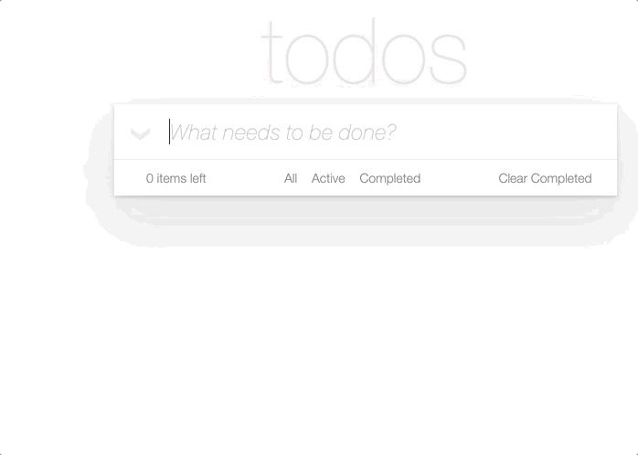

# My Todo App
This is my own version of the simple [To-Do](http://todomvc.com/) app 📝. It was built using vanilla JavaScript ✨.



## Things I learned
The main purpose of creating this app was to practice and acquire new skills in vanilla javascript. This is a vague list of things I learned:
- Configure Webpack, Babel, ESLint and Jest.
- Single responsibility principle creating components that received props and returned HTML elements.
- Function composition.
- Some design patterns such as publish/subscribe and factory functions.
- Vanilla state management using my very own pub/sub implementation.
- Testing and mocking with Jest.
- Dependency injection by using factory pattern to make components easier to test.

## How does it work?
This app requires at least Node v12.

### Install dependencies ⏳📉
```bash
$ npm install
```

### Run the local environment 🌎👩🏻‍💻

```bash
$ npm start
```
### Run the tests and watch 🔎📈

```bash
$ npm run test-dev
```

### Acknowledgment

I would like to give a shout-out to [Romel Pérez](https://github.com/romelperez/) for his invaluable help, for being such a great mentor, and for leading me to apply the best development practices in this project.
